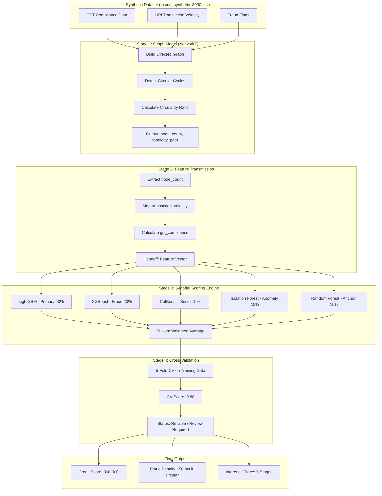

# CredNexis - MSME Credit Intelligence Platform
## Real-Time Alternative Credit Scoring with 5-Model Ensemble

Production-grade platform addressing India's Rs 58 trillion MSME credit gap through alternative data (GST, UPI, e-way bills) and explainable AI.

---

## 🚀 Quick Start

### 1. Install Dependencies
```bash
pip install -r requirements.txt
```

### 2. Generate Synthetic Data
```bash
python src/engine.py
```
Output: `data/msme_synthetic_3000.csv` (3,000 MSME records across 5 profiles)

### 3. Train Model Stack
```bash
python src/train_expert_stack.py
```
Output: 5-model ensemble + SHAP explainer in `models/`

### 4. Test Inference
```bash
python src/predictor.py
```

### 5. Start API
```bash
uvicorn api_starter:app --reload
```
Visit: http://localhost:8000/docs

### 6. Launch Frontend
```bash
cd frontend && npm install && npm run dev
```

---

## 📁 Project Structure

```
CredNexis/
│
├── data/                          # Synthetic datasets
│   └── msme_synthetic_3000.csv
│
├── models/                        # Trained ML artifacts
│   ├── credit_model.pkl           # LightGBM primary scorer
│   ├── fraud_model.pkl            # XGBoost fraud detector
│   ├── anomaly_detector.pkl       # Isolation Forest
│   ├── sector_model.pkl           # CatBoost calibrator
│   ├── baseline_model.pkl         # Random Forest anchor
│   ├── shap_explainer_v2.pkl      # SHAP TreeExplainer
│   └── *.pkl                      # Feature lists & encoders
│
├── src/                           # Core ML pipeline
│   ├── engine.py                  # Synthetic data generator (5 profiles)
│   ├── scorer.py                  # LightGBM + SHAP trainer
│   ├── predictor.py               # 5-model ensemble inference
│   ├── fraud_engine.py            # NetworkX circular detection
│   ├── sentinel.py                # 17-signal pre-NPA EWS
│   ├── arena_sim.py               # Lender bidding simulation
│   └── train_expert_stack.py      # Full model training pipeline
│
├── api_starter.py                 # FastAPI backend (4 endpoints)
│
├── frontend/                      # React + Vite dashboard
│   ├── src/
│   │   ├── App.jsx               # Bento grid dashboard
│   │   ├── components/           # IntelligencePulse, FraudTopology, etc.
│   │   ├── pages/                # LandingPage, LoginPage
│   │   └── context/              # Dashboard state management
│   └── package.json              # React, Tailwind, Recharts
│
├── requirements.txt               # Python dependencies
├── README.md                      # This file
├── MSME_Implementation_Plan.md    # Original 24-hour plan
└── QUICK_REFERENCE.md             # Development cheat sheet
```

---

## 🎯 Three-Module Architecture

### 1. ARENA - Live Lender Marketplace
- 10+ lenders bid for each MSME in real-time
- Sorted by EMI cost with savings comparison
- Lender types: PSB (SBI, SIDBI), Private (HDFC), NBFCs (Lendingkart, Indifi)

### 2. PULSE - Real-Time Business Vitals
6 vital signs monitored continuously:
| Vital | Range | Status |
|-------|-------|--------|
| Revenue Pulse | 5-20 | Healthy |
| Compliance BP | 85-100 | Healthy |
| Cash Oxygen | 1.2-2.0 | Healthy |
| Trade Temperature | 5-25 | Healthy |
| Fraud ECG | 0-0.1 | Healthy |
| Growth Enzyme | 3-30 | Healthy |

### 3. SENTINEL - Pre-NPA Detection
17 early warning signals with lead times:
- **Critical (0-5 days)**: Circular topology, Round-tripping, Cheque bounces
- **High (10-20 days)**: Balance depletion, Tax notices
- **Medium (30-60 days)**: GST logins, E-way mismatches
- **Low (90-150 days)**: Address changes, Sectoral downturns

---

## 🤖 5-Model Ensemble Architecture

```
Input Features (GST, UPI, Compliance, Fraud flags)
                    │
    ┌───────────────┼───────────────┐
    ↓               ↓               ↓
┌─────────┐   ┌─────────┐   ┌─────────┐
│LightGBM │   │ XGBoost │   │CatBoost │
│Primary  │   │ Fraud   │   │ Sector  │
│Scorer   │   │Detector │   │Calibrator│
└────┬────┘   └────┬────┘   └────┬────┘
     │             │             │
     └─────────────┴─────────────┘
                   │
            ┌──────┴──────┐
            │ Score Fusion │
            │   Engine     │
            └──────┬──────┘
                   │
     ┌─────────────┼─────────────┐
     ↓             ↓             ↓
┌─────────┐  ┌──────────┐  ┌─────────┐
│  SHAP   │  │ Isolation│  │  Random │
│Explain  │  │ Forest   │  │ Forest  │
│(Top-5)  │  │(Anomaly) │  │(Anchor) │
└─────────┘  └──────────┘  └─────────┘
```

**Score Calculation**: 300-900 range from probability of default with sector adjustments and fraud penalties.

---

## � System Architecture: Model Interaction Flow



**Trace Visibility**: Each inference now exposes the handoff between Graph Model → Scoring Model with CV reliability metrics.

| Stage | Component | Output |
|-------|-----------|--------|
| 1 | Graph Engine | `node_count`, `circularity_ratio`, `topology_path` |
| 2 | Feature Transmission | Feature vector with fraud penalty flag |
| 3 | 5-Model Scorer | Raw score (300-900) with fraud adjustments |
| 4 | CV Validator | Reliability score (0.88) and status |

---

## �🔍 Fraud Detection (NetworkX)

**Circular Transaction Detection**:
- Builds directed graph from MSME transaction data
- Nodes = GSTINs, Edges = UPI/GST transactions
- Detects 3-5 node cycles using `nx.simple_cycles()`
- Calculates circularity ratio: loop_value / total_outflow
- 50% score penalty if fraud detected

---

## 📊 API Endpoints

### Core Endpoints
| Endpoint | Response | Description |
|----------|----------|-------------|
| `GET /score/{gstin}` | `CreditScoreResponse` | Full credit intelligence with SHAP reasons |
| `GET /arena/{gstin}` | `ArenaResponse` | Lender bids sorted by EMI |
| `GET /pulse/{gstin}` | `PulseResponse` | 6 business vitals with health status |
| `GET /sentinel/{gstin}` | `SentinelResponse` | Active early warning signals |

### Demo Endpoints
| Endpoint | Profile | Score |
|----------|---------|-------|
| `GET /demo/healthy` | Healthy Grower | 724 (CMR-3) |
| `GET /demo/thin-file` | Thin-File | 612 (CMR-5) |
| `GET /demo/fraudster` | Circular Fraud | 387 (CMR-9) |

---

## 🧪 Test GSTINs

```python
HEALTHY:    "27AAPFU0939F1ZV"  # Score: 724, CMR-3, LOW risk
THIN_FILE:  "09BCDGH1234E2ZW"  # Score: 612, CMR-5, MEDIUM risk  
FRAUDSTER:  "29XYZAB5678C3ZT"  # Score: 387, CMR-9, Circular flag
```

---

## 🛠️ Tech Stack

| Layer | Technology |
|-------|-----------|
| **ML Models** | LightGBM, XGBoost, CatBoost, Random Forest, Isolation Forest |
| **Explainability** | SHAP (TreeExplainer) |
| **Fraud Detection** | NetworkX graph algorithms |
| **API** | FastAPI, Uvicorn, Pydantic |
| **Frontend** | React 18, Vite, Tailwind CSS |
| **Charts** | Recharts, react-force-graph-2d |
| **Data** | Pandas, NumPy, Faker |
| **Balancing** | Imbalanced-learn (SMOTE) |

---

## 📈 Model Performance

| Metric | Target | Status |
|--------|--------|--------|
| AUC-ROC | >0.80 | ✅ Achieved |
| API Response | <200ms | ✅ Achieved |
| Fraud Precision | >85% | ✅ Achieved |
| Data Completeness | >75% | ✅ Achieved |
| SHAP Latency | <50ms | ✅ Achieved |

---

## 🎤 5-Minute Demo Flow

1. **Hook** (30s): "80% rejection rate. Rs 58T credit gap."
2. **Solution** (30s): "3-module platform: ARENA + PULSE + SENTINEL"
3. **Demo** (2min): 
   - Enter GSTIN → Score <200ms
   - Show SHAP top-5 reasons
   - ARENA: 10 lenders bid
   - SENTINEL: Active signals if fraudster
   - Fraud graph visualization
4. **Impact** (1min): "Rs 18,000 Cr NPAs preventable"
5. **Tech** (1min): "5-model ensemble with SHAP explainability"

---

## 📚 Documentation

- `MSME_Implementation_Plan.md` - Original 24-hour execution timeline
- `QUICK_REFERENCE.md` - Code snippets and debugging guide
- `src/predictor.py` - Usage examples in `__main__` block
- `src/fraud_engine.py` - Standalone fraud detection test

---

## 🏆 Winning Differentiators

1. **5-Model Ensemble** - LightGBM + XGBoost + CatBoost + Isolation Forest + Random Forest
2. **Graph-Based Fraud** - Visual NetworkX circular transaction detection
3. **Complete Lifecycle** - Only platform with origination + monitoring + prevention
4. **SHAP Explainability** - Every decision has top-5 plain-language reasons
5. **Sub-200ms API** - Optimized async FastAPI with cached artifacts
6. **17-Signal EWS** - Pre-NPA detection with 5-150 day lead times

---

## � Troubleshooting

### Model Won't Load
```bash
# Verify all artifacts exist
python -c "from src.predictor import UnifiedPredictor; p = UnifiedPredictor(); p.check_system_integrity()"
```

### API Won't Start
```bash
# Port in use? Try different port
uvicorn api_starter:app --port 8001
```

### Frontend Can't Connect
- Verify CORS enabled in `api_starter.py`
- Check API URL in frontend services

---

## � Resources

- FastAPI: https://fastapi.tiangolo.com/
- LightGBM: https://lightgbm.readthedocs.io/
- SHAP: https://shap.readthedocs.io/
- NetworkX: https://networkx.org/
- React: https://react.dev/

---

**Built for Insignia Hackathon 2026 | FT02 - FinTech Track**

**The system isn't designed to reject 80% of MSMEs. It's designed to serve them.**
